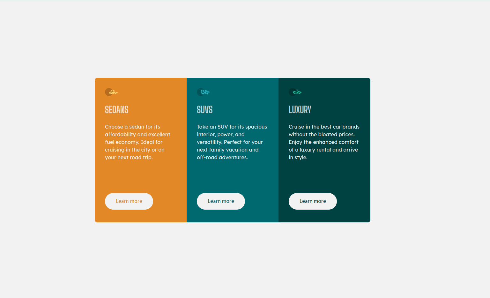

# Frontend Mentor - 3-column Preview Card Component

## Welcome! 👋

This is a solution to the [3-column Preview Card Component](https://www.frontendmentor.io/challenges/3column-preview-card-component-pH92eAR2-). Frontend Mentor challenges help you improve your coding skills by building realistic projects.

## Table of contents

- [Overview](#overview)
  - [Screenshot](#screenshot)
- [My process](#my-process)
  - [Built with](#built-with)
- [Author](#author)

## Overview

### Screenshot

## My process

### Built with

- ReactJs
- TailwindCSS
- HTML5
- CSS
- Flexbox

## Author

- Website - [siunix.com](https://www.siunix.com)
- Twitter - [@siunixdev](https://twitter.com/siunixdev)

**Have fun building!** 🚀